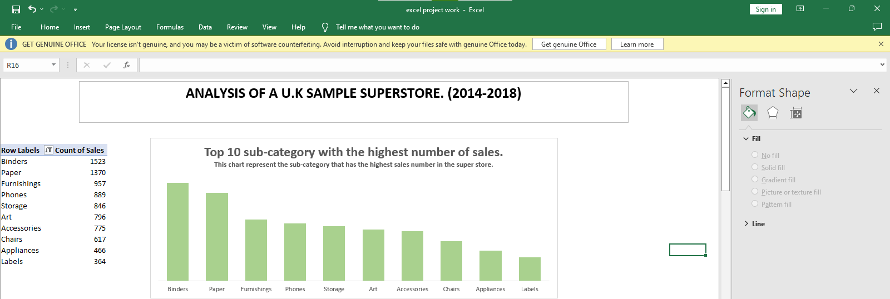
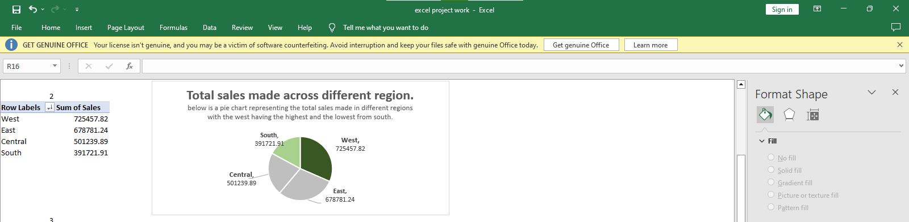
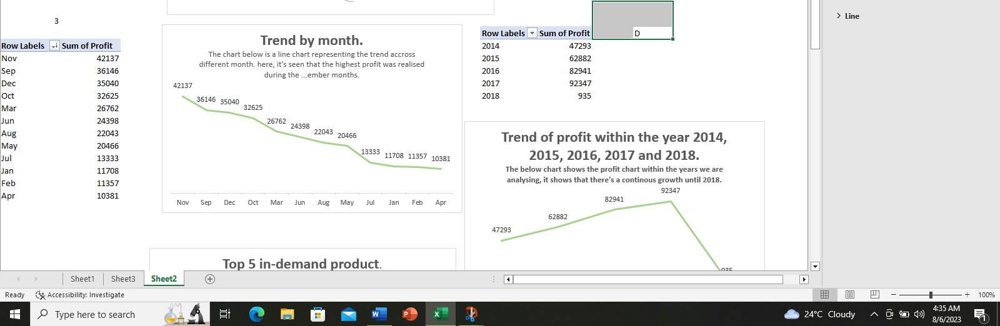
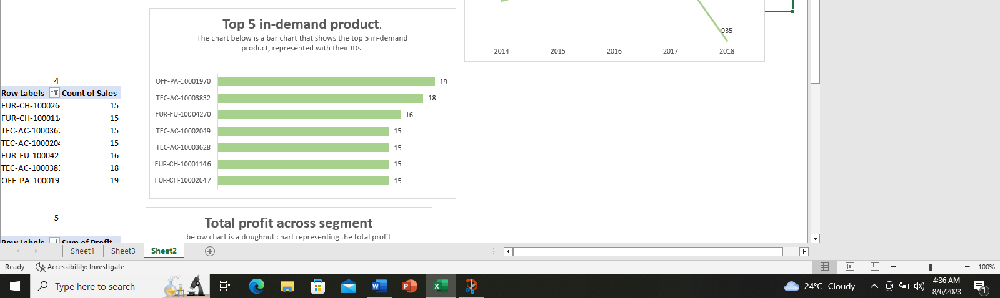
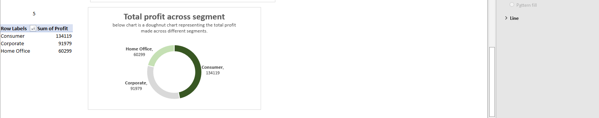
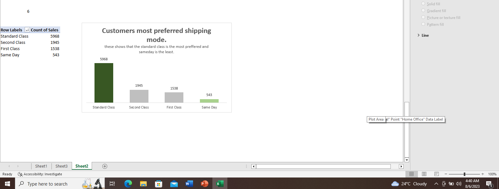

# EXCEL-PROJECT-DATA
**# INTRODUCTION**

After the completion of the Excel class, every participant is required to work on a project to test the understanding of what was taught in class. We were provided with data from a U.S sample superstore to work with. Participants are to come up with 6 different business questions and provide solutions from the data given. 
The data provided was okay to work with little changes, I had to create two new columns, “ship month” and “ship year” because of the questions I will be coming up with. Participants that won’t be working with month/year can skip processes. 

**QUESTIONS CREATED**

1.	What are the first 10 sub-category with the highest number of sales.
2.	The average sales made across the different regions.
3.	Profit trend by month/year.
4.	Customers most preferred shopping mode.
5.	Top 5 in-demand products.
6.	Total profit across segments.

**STEPS TAKEN:**

Answers were provided to the question using a pivot table, while some have other approaches to which they can be answered, pivot tables are straight forward and self-explanatory. All questions were also represented in a visual form to further buttress the point of the pivot table and to make it easy for a layman to read and understand with or without further explanation. Titles and subtitles are added to make it easier.

**KPIs**

One of the requirements for the project from the instructor is create a maximum of 4 KPIs for the company, Key Performance Indicators are single values that help the company/organization to evaluate their performance. This help to see where you’re growing and where more efforts need to made.

. The average profit made by the store.
. The total profit made.
. Percentage of the profit made.
. Total sales made.
The average and total profit was calculated using the “AVERAGE” and “SUM” function and the column range, respectfully. we have a total profit of $286,324 and avrage profit of $2,296,958.

A total sales of $2230.

In other to figure the percentage of the total profit realized, there’s need to calculate that. This was calculated by dividing the sum of total profit made by the sum of total sales made. Which resulted to 12%.

**SOLUTIONS TO QUESTIONS**

1. Top 10 sub-categories with the highest sales number

This shows that the 10 best selling sub-category are, benders, paper, furnishings, phones, storage, art, accessories, chairs, appliances and labels.

2. The average sales made across different regions.

The above image shows that the west region made the highest sales with a total of $725,457.82 while the south made the lowest with a total of $391,721.91.

3. profit trend by month/year

This shows that there's higher profit during the month of Sept, Oct, Nov and December and there's a consistent increase across the years until 2018.

4. Top 5 in-demand products.

5. Total profit across segments.

The total profit across segments shows that the consumer segment made the most profit of a total of $134,119 and the corporate made the lowest profit. a total of $91,979

6. Customer's most preferred shipping mode.

This reveals the most preffered mode to be the STANDARD CLASS.

**# CONCLUSION**

After getting to know the top ten sub-category performing for the store, attention should be paid to what is right with these categories and intensify more effort to increase sales on them, strategies used for their sales can also be copied for other sub-categories especially ones that are performing low.

The average sales made across region helped us to see where are our product performing the best and where are they performing the least? Why is it like that? Does the west have a larger population to have performed the best? Is the PR the largest at that end? What are we doing better here? Answers to these questions help the store to know where and how to improve on other region and keep serving the west better.

The profit trend across the month, shows that there’s significant increase in sales and of cause profit during the month of sept, oct, Nov and Dec. Oftentimes, situations like this can not be controlled by the company because some products are seasonal, there’s a particular season for higher demands of these products. Company can scale up their sales by making more products available during these seasons. Improve their strategies and make the most of those periods.

Top 5 most prefered product has shown which product do customers purchase the most. Company can use this information to determine which product to produce more, which to make more available and make necessary corrections with other products.

The profit across segments reveals the highest profit came from the consumers end.

The customer most preffered shipping mode was realized to be standard class and the least preffered to be sameday shipping. These shows that customers prefer class and standard to rush, as long as product need doesn’t come with urgency. 

   

